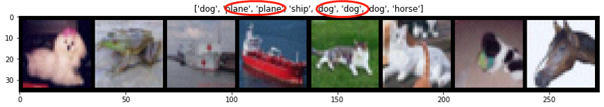

# FGSM
Simple pytorch implementation of FGSM for testing ResNet18 and ResNet20 on CIFAR10

## Introduction
FGSM (Fast Gradient Sign Method) 是一种基于梯度的快速模型对抗样本生成方法，属于白盒攻击。样本生成公式为：
$$ \eta =   \epsilon sign( \nabla_x J(\theta,x,y) )$$ 
$$  \widetilde{x}  = x + \eta$$
- $\epsilon$控制扰动的大小，$||\eta||_{\infin} < \beta $不随问题的维度而变化
- $\theta$: 模型权重
- $J$:损失函数
- $x$: 原始输入
- $\widetilde{x}$: 对抗样本
  
对抗攻击就是使得DNN误判的同时，使得图片的改变尽可能少，一般人眼不能识别为标准如下图所示。

由于权重不能更改，在已知梯度时，在输入上增加扰动使得模型的loss尽可能地大。这里生成对抗样本时，需要反向传播一次梯度。详情见[ICLR15](https://arxiv.org/abs/1412.6572) 。
CIFAR10数据集上的可视化效果，这里$\epsilon$ = 0.05：和原始图片几乎一样

## Result
数据集CIFAR10，网络:ResNet18（自己构建并训练）,ResNet20（直接从Pytorchcv上下载的预训练模型）

RN18测试结果 :
| epsilon | 0    | 0.05 | 0.1    |0.15 | 0.2 |0.25    | 0.3     | 0.4   |
| -       |  -   | - |  -    |   - |  -  | -      | -       | -     |
| acc     |94.48%|37.5%  |27.22% |24.26% |22.69%|21.49%  |19.68%  | 17.37% |

RN20测试结果:
| epsilon | 0    | 0.05 | 0.1    |0.15 | 0.2 |0.25    | 0.3     | 0.4   |
| -       |  -   | - |  -    |   - |  -  | -      | -       | -     |
| acc.       |94.03%|43.89%  |38.99% |34.41% |29.02%|24.45%  |20.57%  | 16.54% |
